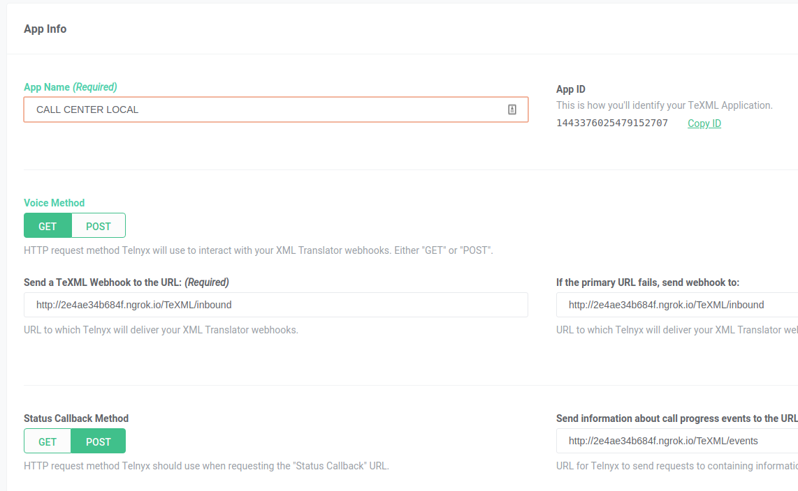

# Aiohttp & TeXML Call Center Solution

## Introduction

This project is an Aiohttp Python server that can be used as a call center solution that leverages Telnyx's TeXML feature.

The application will accept calls to a Telnyx number and forward them on to all credential SIP connections on a Telnyx account using TeXML and sip URI dialing.

Two attempts will be made to dial the sip connections. If both attempts fail to be answered by the sip connections, a voicemail prompt will be given.

## How to get started

There are a few configurations needed to run the application.

#### 1. Setup Telnyx account.

Sign up [here](https://telnyx.com/sign-up).

####2. Install ngrok..

Install ngrok by following this [guide](https://ngrok.com/download). 

Run: 
 
 ``ngrok http 8080`` 
 
 Take note of the forwarding http url.

#### 3. Setup a Telnyx TeXML App.

Setup a TeXML connection [here](https://portal.telnyx.com/#/app/call-control/texml). 

Set the 'Voice Method' to GET and put the url: ngrok_forwarding_url + /TeXML/inbound. Eg. http://b06b087392cd.ngrok.io/TeXML/inbound

Set the Status Callback Method to 'POST'.

**E.g**

#### 4. Obtain a Telnyx Number. Assign to the TeXML connection.

Any number will do! Purchase numbers [here](https://portal.telnyx.com/#/app/numbers/buy-numbers).
And assign to your recently created TeXML connection.

#### 5. Create an Telnyx API Key.

Your Telnyx API Key can be created on this [page](https://portal.telnyx.com/#/app/api-keys)

#### 6. Setup Telnyx credential sip connections, one for each potential agent.

Setup your connections. Set the username to be something unique and representative of the agent you will assign the connection to. 

In the inbound section, enable 'Recieve SIP URI Calls' to 'From anyone'. 

Next, add the outbound event url ngrok_forwarding_ul + /outbound/event 

This form can be found under basic -> Events -> Webhook url.

Lastly, you may want to enable a caller ID override on your sip connection if you are not passing a cli when making outbound calls.
You can do this on the connections outbound settings.

#### 7. Set up an outbound profile and assign all the sip connections.

Setting up an outbound profile is pretty simple. Guide to that [here](https://support.telnyx.com/en/articles/4320411-outbound-voice-profiles). 
Please take note of the profile ID.

Assign all your call center agent sip connections to this outbound profile.

#### 8. Set up virtual env.

For pipenv:

Install with command:

`pip install pipenv`

In call-center-texml directory run:

`pipenv shell`

& then

`pipenv update`

This will create the environment and install the requirements in the pipfile.

#### 9. Run Setup and configure variables.

In the call-center-texml directory, run the following command: 

``python setup.py``

This will create the .env file within the call-center directory.
Open this .env file and fill in the required variables.

*API_KEY:* This is your Telnyx API Key available [here](https://portal.telnyx.com/#/app/api-keys). 

*PROD:* Defaults to True. You can set this to either True or False. If set to True, the scheduled jobs for updating connections and sending balance notifications will run in intervals.  

*SLACK_URL:* The slack url will be found on the slack app for incoming webhooks. More on this can be found [here](https://api.slack.com/messaging/webhooks). 

*NGROK_URL:* For the project you will ned ngrok installed and running. Grad the url you got from step 2 and place here.

*OUTBOUND_PROFILE_ID:* This is the ID of the outbound profile assigned to your connections. Used to know what connections to grab from your account.

Save this file. If these are correct, you should now have everthing you need to run the app.

#### 10. Configure your Answer XML file.

On the condition that the agent hangs up, how do you want this to be handled?

You can specify this in your answer.xml file. A dial is there as a placeholder. If you want nothing to be done. Send an empty XML file.

## Running The Application

Use the following command to execute the application:

``PYTHONPATH=`pwd`/ python call_center/main.py``

You will now see it running on localhost port 8080.

## Optional: Setting up Audio files

Currently, the XML files are configured to serve a 'say' to tell the dialer what is happening. 

However, the server is set up for delivering audio files for things like: initial greeting, 'please stay on hold' and a 'please leave a voicemail' message.

All you need to do is record the audio and place them in in the sub-directory audio.

They should be named:

1. greeting.mp3
2. busy_try_again.mp3
3. voicemail.mp3 

Then un-comment the <play> verbs that are in the busy_template, inbound_template and voicemail XML files.

E.g <Play>{ngrok_url}/TeXML/support_busy</Play>

Then get rid of the says and the TeXML will look for the audio files instead of the say.

## Conclusion

That's it! Now all calls made to your Telnyx number will go to your SIP connections.

